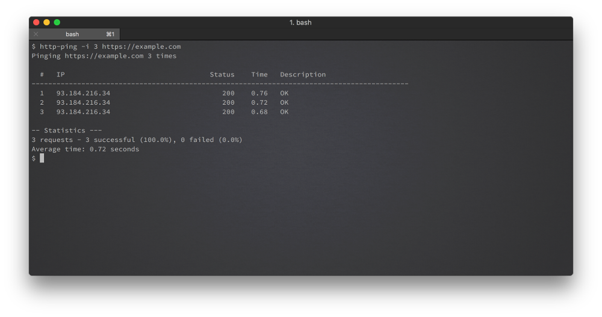
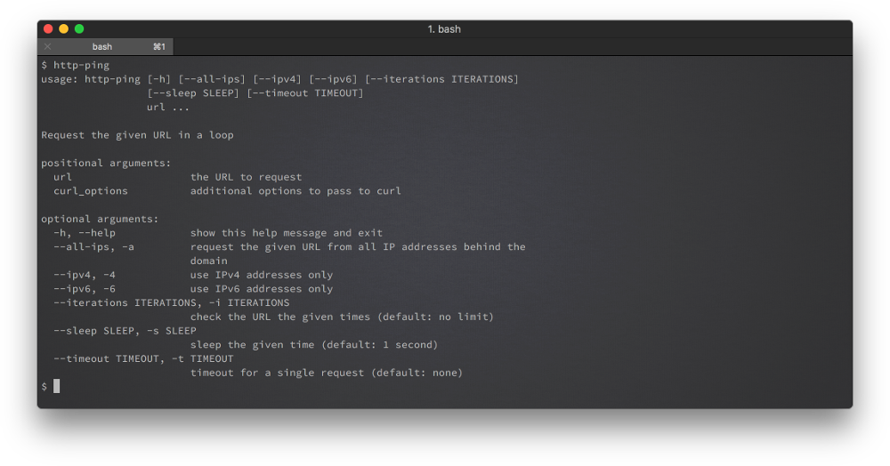

<h1 align="center">
    <br>
    
    <br>
    http-ping
</h1>

<p align="center">
<b>A simple command line tool that returns the HTTP-Status-Code of a URL</b></p>

<p align="center">
This is the result of a fun nightly live coding session at our LsW Telegram channel. We hope that you have just as much fun and that you find it useful as we do.
</p>


### Installation
* download the repository to your local folder
* ```cd``` into the http-ping folder
* have fun :)

To make the usage more comfortable, you can create an alias in your ```.bashrc```:
```
alias http-ping="/yourLocalPath/http-ping/http-ping"
```

### How to use
Just type ```http-ping https://www.example.com```
Press ```ctrl+c``` to stop the process.
At the end you'll see some statistics as it also provides the ping program.

### Options
Parameter | Meaning | Default
--------- | ------- | -------
--all-ips, -a | request the given URL from all IP addresses behind the domain |
--ipv4, -4 | use IPv4 addresses only |
--ipv6, -6 | use IPv6 addresses only |
--iterations, -i | check the URL the given times | no limit
--sleep, -s | sleep the given time | 1 second
--timeout, -t | timeout for a single request | none
--help, -h | show the help message |

### Screenshots / Examples



### Credits
Many thanks to [fragbenny](https://fragbenny.de/) for the logo :)

### License
Copyright © 2017 [Michael Wieland](https://github.com/Programie) and [Michael Rong](https://github.com/mrong)
[GNU General Public License v3.0](LICENCE)